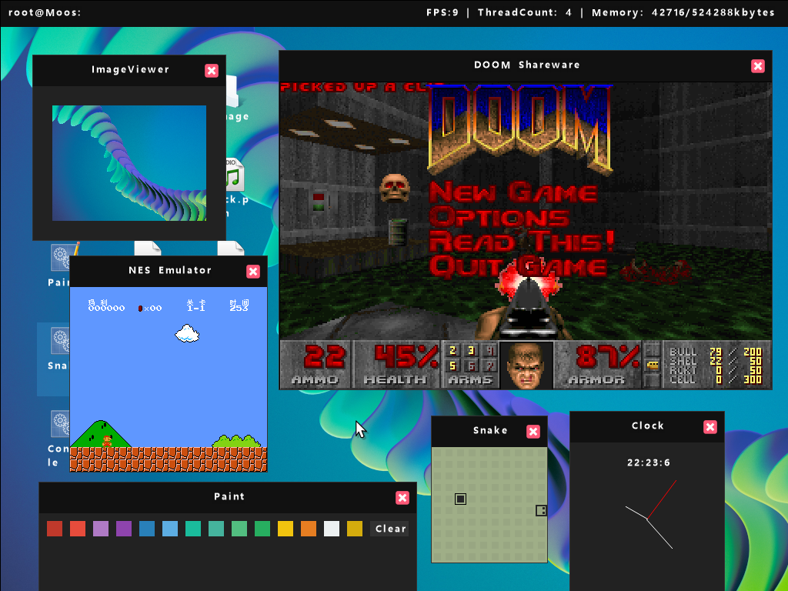
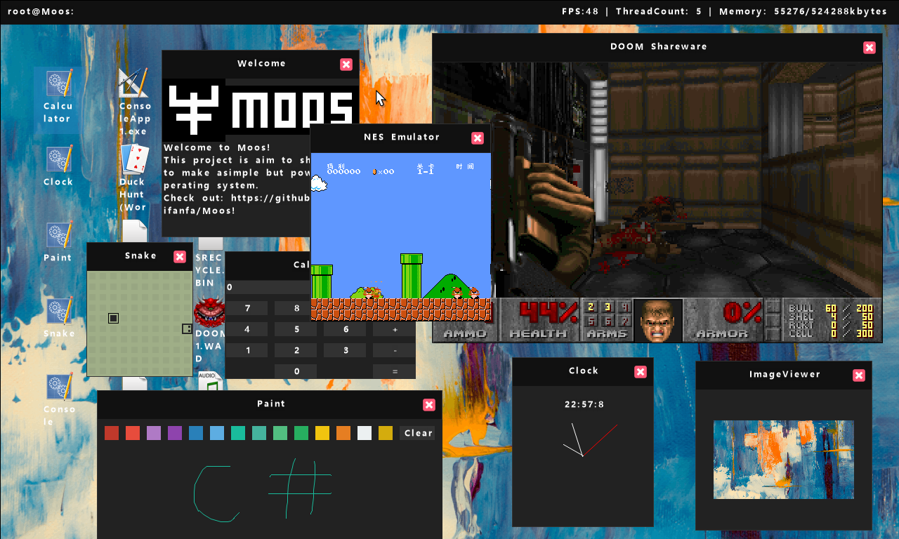
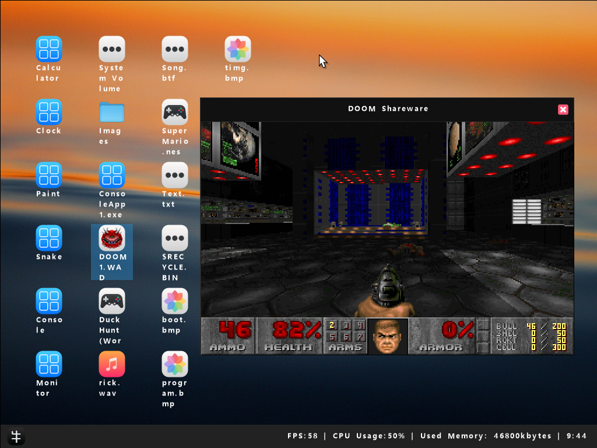
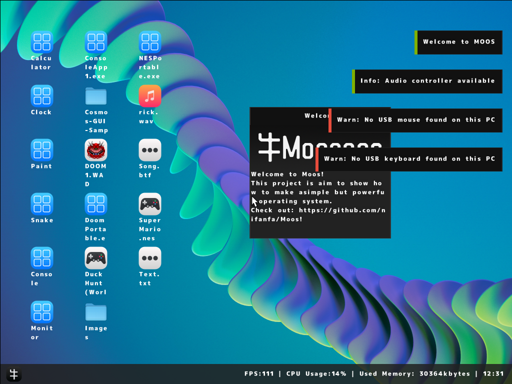

# MOOS
My fork of [MOOS](https://github.com/nifanfa/MOOS/). The goal or research: learn AOT.

## Intro / About MOOS 
MOOS (To Make **M**y **O**wn **O**perating **S**ystem Project) is a C# x64 operating system compiler with the .NET 7 Native AOT technology.

## Building
For information on compiling MOOS, please read the [Build Wiki page](https://github.com/nifanfa/MOOS/wiki/How-do-you-build-or-compile-MOOS%3F).

### Build requirements
- VMware Workstation Player - https://www.vmware.com/products/workstation-player.html
- Visual studio 2022 - https://visualstudio.microsoft.com/
- QEMU - https://www.qemu.org/download or VMWare ( Note - USB Does not work with VMWare and you need x64 if you want to run VMware, 32 bit is not supported )
- Windows 10-11 x64 or x86
- A CPU from at least 2012 or newer, or in basic terms an Ivy Bridge CPU or over
- 4GB of RAM but 8GB is recommended

## Screenshots

## Bugs (or my stupid mind... idk)
No keyboard/mous support found. Can't operate this OS. ^ ^

## References
- https://github.com/nifanfa/ 
- https://github.com/nifanfa/MOOS/

## ..
AS IS. No support. RnD only.

## .
[m][e] 2022

-------------------

# MOOS
Мой форк [MOOS](https://github.com/nifanfa/MOOS/). Цель: разобраться с AOT

## Интро / Про MOOS 
MOOS переводится как Make **M**y **O**wn **O**perating **S**ystem (Моя собственноручная операционная система). Это проект 64-разрядной операционки, собранный с помощью C# и скомпилированный с помощью технологии .NET 7 Native AOT.

## Сборка кода
Для получения информации о компилировании исходного кода (и сборки а целом) MOOS, пожалуйста, обратитесь к Wiki-странице [Build Wiki page](https://github.com/nifanfa/MOOS/wiki/How-do-you-build-or-compile-MOOS%3F).

### Требования к сборке
- VMware Workstation Player - https://www.vmware.com/products/workstation-player.html
- Visual studio 2022 - https://visualstudio.microsoft.com/
- QEMU - https://www.qemu.org/download or VMWare ( Замечание: USB не пашет под VMWare, и Вам необходима 64-битная хостовая машина (x64), если Вы хотите запускать VMware, так как 32 бита не поддерживаются )
- Windows 10-11 x64 или x86
- ЦП (CPU) , выпущенный после 2012 года, ну то есть ЦП с Ivy Bridge или чем-то получше
- 4 гига оперативы (но 8 гигов приветствуются)

## Скриншоты

## Ссыли
- https://github.com/nifanfa/ 
- https://github.com/nifanfa/MOOS/

## ..
Как есть. Без поддержки. Лишь для RnD, т.е. экспериментальная среда.

## .
[m][e] 2022

